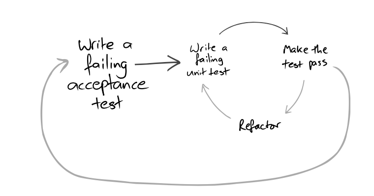

# Intuit Election #

## Acceptance Criteria: ##

A council would like to try new way of elections in a city and adopt it to other cities if it is successful. They want us to build a E-Board for managing elections with following capabilities.

1. Citizens can nominate themselves for the elections as contenders.
2. Contender can post their manifesto on the board. Each manifesto may contain a maximum of 3 ideas.
3. Citizens should be able to see the list of contenders and their respective manifesto.
4. Citizen can rate the ideas on the scale of 0 (bad) to 10 (excellent).
5. Board should allow a citizen to delete his/her rating.
6. If the rating is more than 5, then citizen is added as a follower of the contender. 
7. Anytime a contender posts an idea, an email should be sent out (just do a console.log and not the real mail integration) to his/her followers and even to the followers of recipient (if any).
8. A contender is removed from the election if he/she has at least 1 idea which is rated less than 5 by more than 3 voters. 
9. A contender who has maximum sum of avg.ratings / idea is decided as the winner.
    1. Average Rating Per Idea = Sum of all ratings / No of voters.
    2. Final rating = AvgRating of Idea 1 + Avg Rating of Idea 2 + Avg Rating of Idea 3.

10. Build this system considering space and time efficiency along with OOP principles. [User interface is not a must have. Running program in a terminal is sufficient]
11. You should consider writing code that you would be comfortable submitting for a PR. Please state any assumptions or areas you could not complete due to time pressure.

## My Approach ##

### TDD ###
I have approached the implementation of the acceptance criteria above using a Test-Driven Development approach as documented in the book, [Growing Object-Oriented Software, Guided by Tests](http://www.growing-object-oriented-software.com/), 
which is my bible with regard to guiding the delivery of quality software quickly. As a consequence, the acceptance criteria have been converted into a number of high-level acceptance tests, 
each of which was used to drive the implementation and further testing of a discrete feature of the implementation. The technique I used followed the cycle illustrated below.

#### My Philosophy ####

The TDD approach encourages the quick development of 'simple' implementations which do not suffer from [unncessary gold plating](https://blog.thecodewhisperer.com/permalink/you-have-to-know-when-to-stop). In this case, because I used this approach 
I did not feel it was necessary for me to provide a Command Line interface for the Election Board service. (However, time constraints also meant that I ran out of time to implement this anyway!).

If further exploratory testing is required, the Election Board Service can be interacted with programmatically as illustrated in the `ElectionAcceptanceTest` class.

In my opinion, using TDD creates an architecture which buys you flexibility - similar to buying an option - you are buying the ability to change things later when more information is available. In this case
the new information would be requirements about specific Election Service clients/front ends and non-functional requirements regarding the performance
of the Election Service itself in specific circumstances.

#### Acceptance Test Format ####
Usually I would advocate writing acceptance tests using a [BDD](https://www.agilealliance.org/glossary/bdd) style and a tool such as [Cucumber](https://cucumber.io/), however due to time constraints I have implemented the Acceptance tests using pure JUnit4 instead.

### Lombok ###
I have relied on the [Project Lombok](https://projectlombok.org/) library to reduce the amount of boiler plate code I had to write. In particular, I was keen to use it to support the easy generation of Immutable Value Objects which should be returned from calls to the
Election Service, thus assuring that these objects can safely be used elsewhere without impacting the internal state of the Election Service. Additionally, Lombok will generate sensible default `Equals` and `HashCode` methods for classes which I rely on for checking 
value equality and reducing the collision rate of objects when they are used as keys to a hashing mechanism.

### Security ###
The Election Service relies on a `CitizenToken` being provided when interacting with most features of the service. **This token is assumed to be valid and uniquely identifies a registered user of the service**. Time constraints meant that I was unable to implement a 'security layer' 
wrapping the Election Service which would validate the authenticity of the token before allowing interaction with the Election Service.

### Data Structures ###
In the majority of cases I have had to make assumptions about the access patterns of the service to decide which data structures to use. For example, the use of a `LinkedList` within the `ContenderService` where I felt like the insertion of a follower
would be more likely than the random access required to retrieve a follower. In the majority of cases, I have taken the simplest possible option as an initial step, so the use of `HashMap` is prevalent as it provides efficient lookup of data out of the box
in conjunction with the `HashCode` methods generated by Lombok (see **Lombok** above). In some cases, a `Set` is used where I wish to make sure entries are not duplicated.

I ran out of time to test the efficiency of these data structures with any significant amount of data so it would be wise to consider these data structures a 'start point' to iterate over in conjunction
with tests that simulate access patterns rather than the 'most appropriate' data structure.

### Exception Handling ###
The TDD approach has resulted in the majority of exception handling being pushed into the low-level services while refactoring based on the response of 'listening to the tests'. In most cases the exception thrown is an unchecked `UnsupportedOperationException` which
bubbles up to the clients of the `ExceptionService` where it's message should provide a meaningful explanation as to the cause of the problem. Additional thought is likely required to understand whether A) Differentiation between different types of exception
is required to allow clients to react differently in specific circumstances and B) Unchecked exceptions are appropriate for circumstances that represent a 'business level' problem. The [official guidelines for Java 8 unchecked exceptions](https://docs.oracle.com/javase/tutorial/essential/exceptions/runtime.html) 
indicate that perhaps checked exceptions should be used in circumstances that a client can recover from (e.g. A Contender attempting to vote for their own idea).

## Assumptions ##
* There will be a ‘security layer’ that wraps the functionality of the Election and prevents invalid Citizen Tokens being provided when a Citizen interacts with the election (see **Security** above)
* A manifesto must have at least one idea before it can be posted. Contenders can add more ideas later up to a maximum of 3.
* A contender cannot remove their ideas from their manifesto. (Seems sensible but not implemented as not explicitly specified in acceptance criteria. The `RatedIdeaService` does support this action but it is not exposed by the `ElectionService`)
* When a follower deletes their rating it’s unclear whether they stop becoming a follower. (Seems sensible but not implemented as not explicitly specified in acceptance criteria)
* Contenders cannot rate their own ideas

## Things I Ran Out Of Time To Implement ##
* Security layer (see **Security** above)
* Acceptance tests using Cucumber (see **Acceptance Test Format** above)
* Email addresses are represented as String objects. There is no validation on them.
* Follower of follower implementation for sending emails. 
* Removal of Contender if he/she has at least 1 idea which is rated less than 5 by more than 3 voters.
* Thread safety: There is no explicit mechanism for dealing with potentially unsafe updates to ratings of an idea etc.
* Command Line interface (or any other user interface)

## Build Instructions ##
* JDK/JRE 8 or above is required
* Build the project by executing the command `./gradlew clean build` in *NIX environments or `gradlew.bat clean build` for Windows environments.
* Test reports will be generated in the `build/reports/tests` directory. There are distinct reports for **Acceptance** and **Unit** Tests (`acceptanceTest` and `test` directories respectively).
